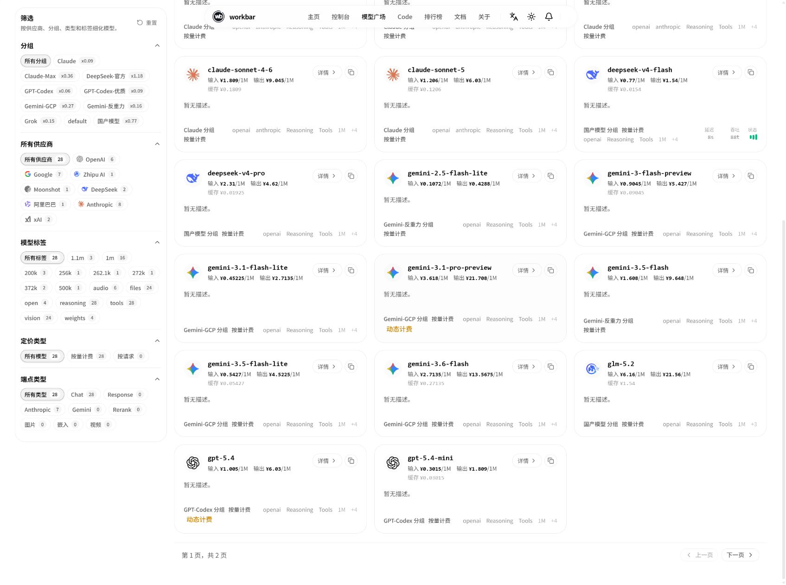
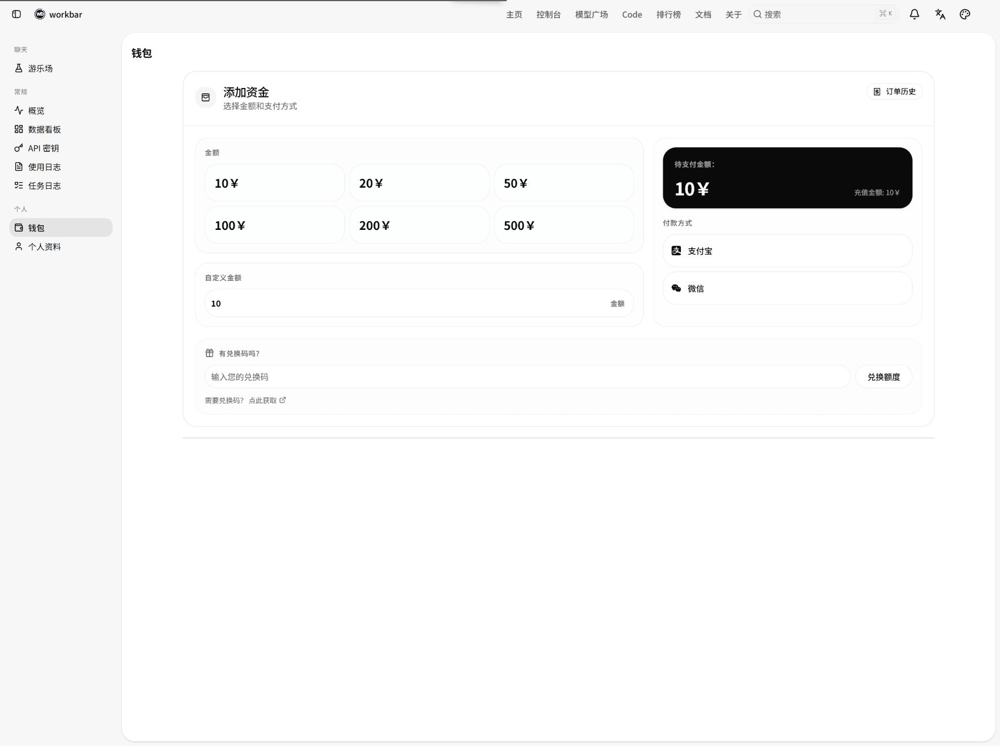

# 余额、价格与使用记录

这篇文章帮助你看懂 workbar 的余额和模型价格，完成充值，并用使用日志核对每次模型调用的费用。

结算货币、模型价格、支付方式、最低充值金额和推荐奖励都由当前系统配置决定。涉及金额时，请以页面当前显示为准。

## 先看懂三个数字

在“钱包”或“个人资料”页面中，你会看到类似下面的信息：

| 名称 | 含义 |
| --- | --- |
| 当前余额 | 账号还可以用于模型调用的额度 |
| 总用量 | 账号到目前为止累计消耗的额度，不是本月剩余额度 |
| API 请求 | 账号累计发起的模型请求次数 |

页面会按照系统当前设置的结算货币显示金额。不要把旧截图中的货币符号或数值当作当前配置。

## 使用前查看模型价格

1. 打开顶部导航中的[模型广场](https://workbar.ai/pricing)；
2. 搜索准备使用的模型；
3. 查看计费类型、输入与输出价格、可用分组等信息；
4. 如果使用固定分组，确认目标模型属于该分组；
5. 如果使用自动分组，记住实际费用由请求最终选中的分组决定。

常见计费方式有：

- **按 Token 计费**：通常分别计算输入和输出。输入是你发给模型的内容，输出是模型生成的内容；
- **按次计费**：每完成一次相应请求，按页面显示的单次价格计费。

部分模型还会显示缓存或其他价格项，只有请求实际使用相应能力时才会生效。自动分组也不等于最低价选择，详细规则请参阅[模型、分组与自动选择](../models/models-and-auto-routing.md)。

_在模型广场核对模型名称、计费方式、价格和可用分组。图中数值仅作界面示意，请以页面实际显示为准。_

> **检查要点** 
> 在开始大量使用前，确认模型名称、计费类型、价格和可用分组都符合预期。

## 在钱包中充值

1. 登录 workbar，打开控制台中的[钱包](https://workbar.ai/wallet)；
2. 在“添加资金”区域选择预设金额，或填写自定义金额；
3. 选择页面当前提供的支付方式；
4. 在右侧明细或确认窗口中核对金额和支付方式；
5. 点击“确认付款”，按支付页面提示完成操作；
6. 返回钱包刷新余额，必要时打开“订单历史”确认结果。

_在钱包中选择充值金额和支付方式，并在付款前核对右侧明细。图中金额和支付方式仅作界面示意，请以页面实际显示为准。_

确认窗口中的两个金额含义不同：

- **充值金额**：支付成功后计入 workbar 余额的额度；
- **待支付金额**或**您支付**：通过所选支付方式实际支付的金额。

两者可能相同，也可能因当前活动、折扣或系统配置而不同。付款前应核对完整明细，不要只看按钮上的数字。

> **完成标志** 
> 订单状态显示成功，并且钱包中的当前余额已经更新。

## 查看订单或使用兑换码

在钱包中打开“订单历史”，可以查看订单号、创建时间、状态、支付方式和金额等信息。

支付后余额暂时没有更新时，先检查订单状态，不要立即重复付款。长时间没有变化时，记录订单号、支付时间和页面状态后再寻求帮助；公开反馈中不要发送完整付款凭据、付款账号或二维码。

如果钱包显示兑换码入口，可以输入有效兑换码并点击“兑换额度”。兑换码功能、有效期和面额以页面及兑换码来源的说明为准，不要从不可信渠道购买或公开分享兑换码。

## 用使用日志核对消费

模型广场显示当前价格，使用日志记录实际请求。核对某次调用时：

1. 打开控制台侧边栏中的“使用日志”；
2. 选择请求发生的大致时间范围；
3. 按模型、分组或类型筛选，必要时填写 API 密钥名称或请求 ID；
4. 打开目标记录，查看模型、耗时、Token、费用和详情；
5. 使用自动分组时，确认这次请求实际选中的分组。

筛选结果为空时，先扩大时间范围并清除过多条件。日志可能需要短暂刷新后才会出现。

## 费用与预期不一致时

不要只用“请求次数 × 一个价格”估算费用。按下面顺序核对：

1. 确认日志中的模型名称；
2. 确认实际分组，尤其是自动分组请求；
3. 查看输入、输出、缓存等用量字段；
4. 确认该模型是按 Token 还是按次计费；
5. 对照模型广场当前显示的价格项；
6. 保存请求 ID 和发生时间，便于进一步核对。

模型价格可能更新，因此当前模型广场不一定能直接反推出历史请求的结算结果。对具体历史记录有疑问时，以该条日志和系统结算记录为准。

## 推荐奖励如何进入余额

每个用户的推荐链接都与自己的账号绑定。奖励金额和生效条件以钱包“推荐计划”区域当前显示为准。

成功邀请新用户并满足当前规则后：

- **受邀请者的奖励**会直接进入受邀请者的主余额，无需手动领取；
- **邀请者的奖励**先进入可转移奖励，不会自动加入主余额；
- 邀请者看到“转移到余额”按钮后，需要打开确认窗口并手动完成转移；
- “累计收入”是历史总计，不等于当前仍可转移的金额。

邀请者转移奖励的步骤：

1. 打开钱包中的“推荐计划”；
2. 查看奖励状态、可转移奖励和累计收入；
3. 出现“转移到余额”按钮后点击它；
4. 在确认窗口中核对可用奖励和转移金额；
5. 确认转移，再刷新当前余额。

如果暂时没有转移按钮，通常表示当前没有达到页面显示的可转移条件。不要把“累计收入”直接当作可领取金额。

## 控制费用的简单做法

- 为不同工具或项目创建独立 API 密钥，方便筛选日志；
- 对不需要无限使用的密钥设置单独额度；
- 只允许项目需要的模型，减少误选高价模型；
- 长任务开始前查看模型广场，使用后核对日志；
- 不再使用的密钥及时停用，疑似泄露时立即更换。

密钥的额度、分组和模型限制设置请参阅[管理 API 密钥](../keys/manage-api-keys.md)。

## 下一步

- 阅读[模型、分组与自动选择](../models/models-and-auto-routing.md)，理解实际分组怎样影响费用；
- 阅读[管理 API 密钥](../keys/manage-api-keys.md)，为不同工具设置独立密钥和额度；
- 充值、日志或奖励出现异常时，打开[常见问题排查](../troubleshooting/common-problems.md)。

---

金额、货币、价格、支付方式和奖励规则请以 workbar 页面当前显示为准。
