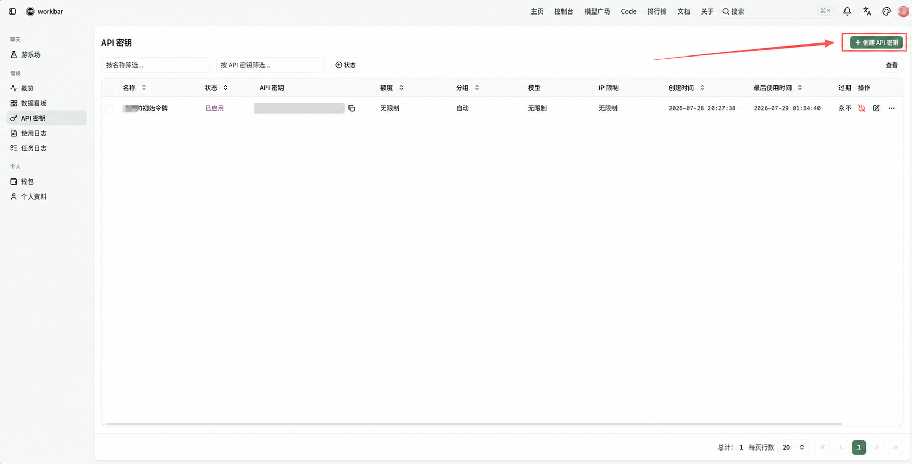
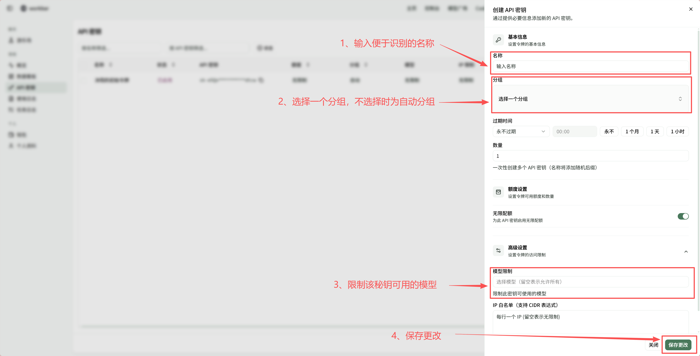
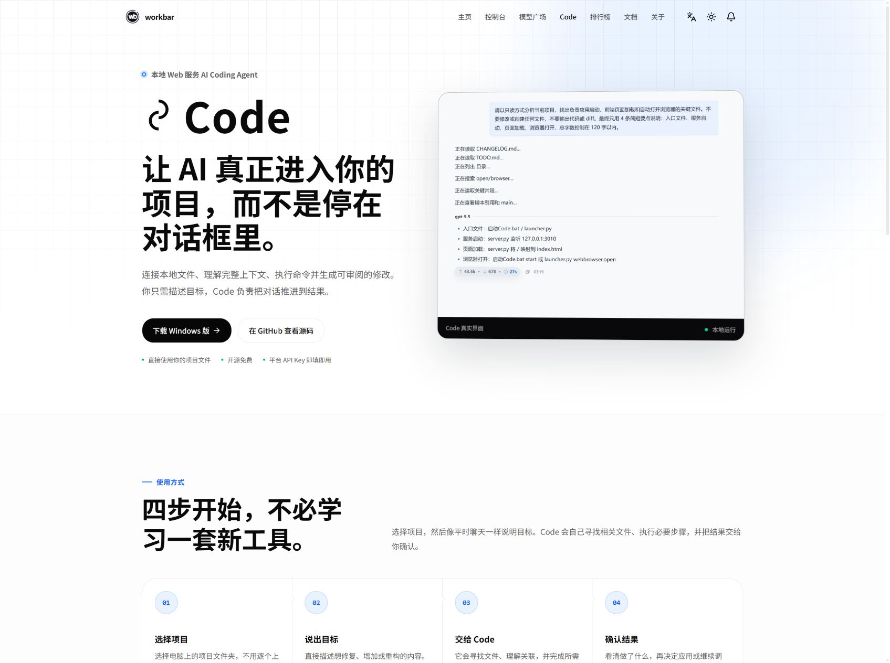

# 快速开始

本指南适合第一次使用 workbar 的用户，不需要 API 或编程知识。你将依次完成注册、创建 API 密钥、连接 workbar Code，并发送第一次任务。看到 Code 正常返回回答，就表示首次连接成功。

## 开始前准备

- 一台可以联网的 Windows 10 或 Windows 11 电脑；
- 一个可以接收验证码的邮箱；
- 电脑上的一个文件夹，空文件夹也可以。

如果没有合适的项目，可以新建一个名为 `workbar-test` 的空文件夹。本指南使用“只读分析”模式，不会修改其中的文件。

## 第一步：注册并登录 workbar

1. 打开 [workbar 注册页面](https://workbar.ai/sign-up)。
2. 填写用户名、8～20 个字符的密码和确认密码。
3. 如果页面显示邮箱验证项，请填写邮箱，发送并输入收到的验证码。
4. 完成注册后，系统通常会直接登录并进入控制台。如果回到登录页，请使用页面预填的用户名和刚才设置的密码登录。

> **完成标志**<br>
> 登录成功并进入 workbar 控制台。

## 第二步：创建 API 密钥

API 密钥是 workbar Code 调用模型时使用的凭据，它不是登录密码。不要把完整密钥发送给其他人，也不要让它出现在截图、公开文档或聊天记录中。本指南后续会让 Code 自动同步密钥，不需要提前复制。

1. 点击顶部导航中的“控制台”。
2. 在控制台侧边栏中打开“API 密钥”。
3. 点击右上角的“创建 API 密钥”。



_在 API 密钥页面点击右上角的“创建 API 密钥”。_

4. 名称填写 `workbar Code`，也可以使用其他容易识别的名称。
5. 分组不选择具体分组；如果页面没有显示已选分组，也不需要手动选择。保存后这把密钥会使用“自动”分组。
6. 到期时间、数量和无限配额保持页面默认值。
7. 展开“高级设置”，让“模型限制”保持为空。
8. 点击“保存更改”。

> **首次使用提示**<br>
> “无限配额”只表示这把密钥没有单独的额度上限，调用模型仍会消耗账号余额。其他设置可以在完成首次连接后，再通过[《管理 API 密钥》](../keys/manage-api-keys.md)和[《模型、分组与自动选择》](../models/models-and-auto-routing.md)了解。



_填写便于识别的名称，分组不选择具体分组，其他设置保持默认，然后点击“保存更改”。_

创建完成后不需要复制密钥。完成 workbar Code 授权后，Code 会自动同步账号中已启用的 API 密钥。

> **完成标志**<br>
> 新密钥出现在 API 密钥列表中，并且处于启用状态。

## 第三步：下载并启动 workbar Code

workbar Code 是运行在你电脑上的 AI 工具，通过浏览器页面操作。本指南只让它查看你选择的文件夹，不会修改文件。

1. 打开 [workbar Code 页面](https://workbar.ai/code)。
2. 点击“下载 Windows 版”。



_在 workbar Code 页面点击“下载 Windows 版”。页面上的版本、文件大小等信息以实际显示为准。_

3. 下载完成后，双击运行 Code 程序。
4. Code 启动后会在浏览器中打开本地页面：

```text
http://127.0.0.1:3010/
```

地址以 `127.0.0.1` 开头是正常的，表示页面来自你自己的电脑。使用时请保持 Windows 系统托盘中的 Code 程序运行。关闭浏览器标签页不会退出 Code；退出托盘程序后，本地页面才会停止工作。

> **完成标志**<br>
> 浏览器成功打开 Code 页面，并显示“连接到 workbar”。

## 第四步：连接 workbar

1. 点击“连接 workbar”。
2. 浏览器会打开 workbar 页面；如果尚未登录，请先完成登录。
3. 在授权页点击 `Connect`（连接）。
4. 授权成功后页面会自动返回 Code，请等待账号信息、API 密钥和模型列表同步。

Code 不会获取或保存你的 workbar 登录密码。连接完成后，它会自动同步账号中的 API 密钥和模型；正常情况下，不需要你手动粘贴密钥或填写服务地址。

> **完成标志**<br>
> 连接提示消失并进入 Code 主界面，模型选择器中出现可用模型。如需确认账号状态，可以打开“设置 → workbar 账号”，查看“已连接 workbar”。

## 第五步：选择文件夹、模型和只读模式

1. 在 Code 左侧栏的“文件”区域，点击当前文件夹名称，再选择“选择文件夹…”。
2. 选择一个准备让 Code 查看或处理的本地文件夹。
3. 在输入框下方左侧，将权限模式切换为“只读分析”。这个模式只会查看和分析文件，不会修改内容。
4. 在输入框下方右侧点击“选择模型”，从列表中选择一个当前可用模型。模型就是实际回答问题和处理任务的 AI。

其他权限模式将在[《使用 workbar Code》](../tools/workbar-code.md)中说明。

> **完成标志**<br>
> 左侧栏的项目或文件区域显示所选目录，输入框下方显示所选模型和“只读分析”。

## 第六步：完成第一次任务

在输入框中发送下面这段话：

```text
请只查看当前文件夹，总结你看到的内容。不要修改任何文件。
```

发送后，Code 会读取当前文件夹并返回回答。如果文件夹为空，Code 可能会说明没有可分析的文件；只要任务正常完成并返回回答，就说明连接可用。

> **完成标志**<br>
> Code 正常返回回答。至此，首次连接已经完成。你也可以稍后到 workbar 控制台的“使用日志”查看这次调用；如果记录没有立即出现，请刷新使用日志页面。

## 如果没有成功

| 提示或现象 | 优先检查 |
| --- | --- |
| 下载后没有打开本地页面 | 检查系统托盘中是否有 Code 图标，然后在浏览器打开 `http://127.0.0.1:3010/`。 |
| 一直停留在“连接到 workbar” | 确认浏览器中的 workbar 已登录，再点击“连接 workbar”重新完成授权。 |
| 已连接但没有 API 密钥 | 先刷新或重新打开 Code，让它再次自动同步。仍未出现时，打开“设置 → 模型 → 从 workbar 获取”，在弹窗中复制所需密钥并粘贴到 Key 列表。若没有可复制的密钥，请回到 workbar 确认至少有一把已启用密钥。 |
| 已有密钥但没有模型 | 打开“设置 → 模型”，点击可用模型旁的“重新检测可用模型”图标；仍然没有时，再检查密钥的分组和模型限制。 |
| 提示余额不足 | 打开 workbar 控制台中的“钱包”，确认当前余额并按需充值。 |
| 出现 `401`、`429`、`5xx` 或其他错误 | 先停止反复重试，再按照[《常见问题排查》](../troubleshooting/common-problems.md)检查密钥、请求频率和服务状态。 |

仍未解决时，请记录 Code 版本、模型名称、错误文字和发生时间，再按[《常见问题排查》](../troubleshooting/common-problems.md)收集信息。不要提供完整 API 密钥、登录密码或私人文件。

## 下一步

- 继续使用 Code：阅读[《使用 workbar Code》](../tools/workbar-code.md)；
- 连接 Claude Code 或其他 AI 工具：阅读[《在 Claude Code 中使用 workbar》](../tools/claude-code.md)或[《连接其他兼容工具》](../tools/compatible-tools.md)；
- 管理密钥、模型和费用：阅读[《管理 API 密钥》](../keys/manage-api-keys.md)、[《模型、分组与自动选择》](../models/models-and-auto-routing.md)和[《余额、价格与使用记录》](../billing/balance-pricing-and-usage.md)；
- 自己编写程序接入：阅读[《API 接入概览》](../api/index.md)。

---

本文适用于 workbar 当前新版前端和 workbar Code Windows 版。最后核对日期：2026-08-09。
